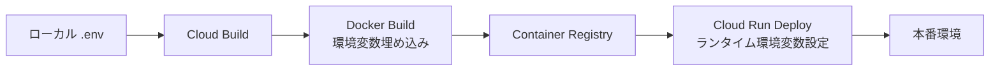

# Google Cloud Run デプロイガイド

月歌生成アプリをGoogle Cloud Runにデプロイする手順

## 🔧 事前準備

### 1. Google Cloud SDK のインストール
```bash
# インストール確認
gcloud --version

# 未インストールの場合
# https://cloud.google.com/sdk/docs/install からダウンロード
```

### 2. Google Cloud プロジェクトの設定
```bash
# プロジェクトを選択
gcloud config set project YOUR_PROJECT_ID

# 現在の設定確認
gcloud config list
```

### 3. 必要なAPIの有効化
```bash
# Cloud Build API
gcloud services enable cloudbuild.googleapis.com

# Cloud Run API
gcloud services enable run.googleapis.com

# Container Registry API
gcloud services enable containerregistry.googleapis.com

# Secret Manager API (Secret Manager使用時)
gcloud services enable secretmanager.googleapis.com
```

## 📦 デプロイ方法

### 方法1: 簡単デプロイ（推奨）

**シェルスクリプトを使用**

```bash
# スクリプトに実行権限を付与
chmod +x deploy.sh

# デプロイ実行
./deploy.sh
```

このスクリプトは自動的に:
- `.env`ファイルから環境変数を読み込み
- Google Cloud Buildを実行
- Cloud Runにデプロイ
- デプロイURLを表示

### 方法2: 手動デプロイ

**環境変数を指定してCloud Buildを実行**

```bash
# .envファイルから環境変数を読み込み
source .env

# Cloud Buildでデプロイ
gcloud builds submit \
  --config=cloudbuild.yaml \
  --substitutions=\
_SUPABASE_URL="${REACT_APP_SUPABASE_URL}",\
_SUPABASE_ANON_KEY="${REACT_APP_SUPABASE_ANON_KEY}",\
_CLAUDE_API_KEY="${CLAUDE_API_KEY}"
```

### 方法3: Secret Managerを使用（本番環境推奨）

**1. Secret Managerにシークレットを作成**

```bash
# Claude API Key
echo -n "YOUR_CLAUDE_API_KEY" | gcloud secrets create claude-api-key \
  --data-file=- \
  --replication-policy="automatic"

# Supabase URL
echo -n "YOUR_SUPABASE_URL" | gcloud secrets create supabase-url \
  --data-file=- \
  --replication-policy="automatic"

# Supabase Anon Key
echo -n "YOUR_SUPABASE_ANON_KEY" | gcloud secrets create supabase-anon-key \
  --data-file=- \
  --replication-policy="automatic"
```

**2. Cloud Build サービスアカウントに権限付与**

```bash
PROJECT_ID=$(gcloud config get-value project)
PROJECT_NUMBER=$(gcloud projects describe $PROJECT_ID --format='value(projectNumber)')

# Secret Manager アクセス権限を付与
gcloud projects add-iam-policy-binding $PROJECT_ID \
  --member=serviceAccount:$PROJECT_NUMBER@cloudbuild.gserviceaccount.com \
  --role=roles/secretmanager.secretAccessor
```

**3. Secret Managerを使用してデプロイ**

```bash
gcloud builds submit --config=cloudbuild-with-secrets.yaml
```

## 🔍 デプロイ状態の確認

### アプリケーションURL取得
```bash
gcloud run services describe tsukiuta-web \
  --region=asia-northeast1 \
  --format='value(status.url)'
```

### ログ確認
```bash
# リアルタイムログ
gcloud run services logs tail tsukiuta-web --region=asia-northeast1

# 最新100件のログ
gcloud run services logs read tsukiuta-web --region=asia-northeast1 --limit=100
```

### 環境変数確認
```bash
gcloud run services describe tsukiuta-web \
  --region=asia-northeast1 \
  --format='value(spec.template.spec.containers[0].env)'
```

## 🔧 トラブルシューティング

### 環境変数が読み込めない場合

**症状**: アプリは起動するがAPIキーエラーが発生

**原因チェック**:
```bash
# Cloud Runの環境変数を確認
gcloud run services describe tsukiuta-web \
  --region=asia-northeast1 \
  --format='yaml(spec.template.spec.containers[0].env)'
```

**解決方法**:
```bash
# 環境変数を手動で更新
gcloud run services update tsukiuta-web \
  --region=asia-northeast1 \
  --set-env-vars CLAUDE_API_KEY=YOUR_KEY
```

### ビルドが失敗する場合

**ビルドログ確認**:
```bash
# 最新のビルド状況
gcloud builds list --limit=5

# 特定のビルドの詳細
gcloud builds log BUILD_ID
```

**よくある原因**:
- `_SUPABASE_URL`, `_SUPABASE_ANON_KEY`, `_CLAUDE_API_KEY` の変数が未設定
- `.env`ファイルの形式エラー
- Cloud Build APIが有効化されていない

### CORS エラーが発生する場合

Cloud Runはデフォルトで全てのオリジンを許可していますが、問題がある場合:

```bash
# サービスを再デプロイ
gcloud run services update tsukiuta-web \
  --region=asia-northeast1 \
  --set-env-vars NODE_ENV=production
```

## 📊 リソース設定

### メモリとCPUの調整

```bash
# メモリを1GBに増やす
gcloud run services update tsukiuta-web \
  --region=asia-northeast1 \
  --memory=1Gi

# CPUを2コアに増やす
gcloud run services update tsukiuta-web \
  --region=asia-northeast1 \
  --cpu=2
```

### オートスケーリング設定

```bash
# インスタンス数の調整
gcloud run services update tsukiuta-web \
  --region=asia-northeast1 \
  --min-instances=0 \
  --max-instances=20
```

## 🔐 セキュリティ推奨事項

### 1. Secret Manager使用（本番環境）
`.env`ファイルではなく、Secret Managerで機密情報を管理

### 2. IAM権限の最小化
Cloud Buildサービスアカウントに必要最小限の権限のみ付与

### 3. 認証の追加（オプション）
```bash
# 認証を要求（パブリック公開しない場合）
gcloud run services update tsukiuta-web \
  --region=asia-northeast1 \
  --no-allow-unauthenticated
```

## 📝 環境変数一覧

### ビルド時（Reactアプリに埋め込み）
- `REACT_APP_SUPABASE_URL`: Supabase プロジェクトURL
- `REACT_APP_SUPABASE_ANON_KEY`: Supabase 匿名キー
- `REACT_APP_CLAUDE_API_KEY`: Claude APIキー（フロントエンド用）
- `REACT_APP_CLAUDE_API_URL`: Claude APIエンドポイント
- `REACT_APP_CLAUDE_MODEL`: 使用するClaudeモデル

### 実行時（サーバー側）
- `CLAUDE_API_KEY`: Claude APIキー（バックエンド用）
- `NODE_ENV`: 実行環境（`production`）
- `PORT`: ポート番号（Cloud Runが自動設定）

## 🚀 デプロイフロー



## 📞 サポート

デプロイに問題がある場合:
1. ログを確認: `gcloud run services logs tail tsukiuta-web --region=asia-northeast1`
2. 環境変数を確認: `gcloud run services describe tsukiuta-web --region=asia-northeast1`
3. ビルド履歴を確認: `gcloud builds list --limit=5`

---

**重要**: `.env`ファイルは絶対にGitリポジトリにコミットしないでください。`.gitignore`に必ず追加してください。
